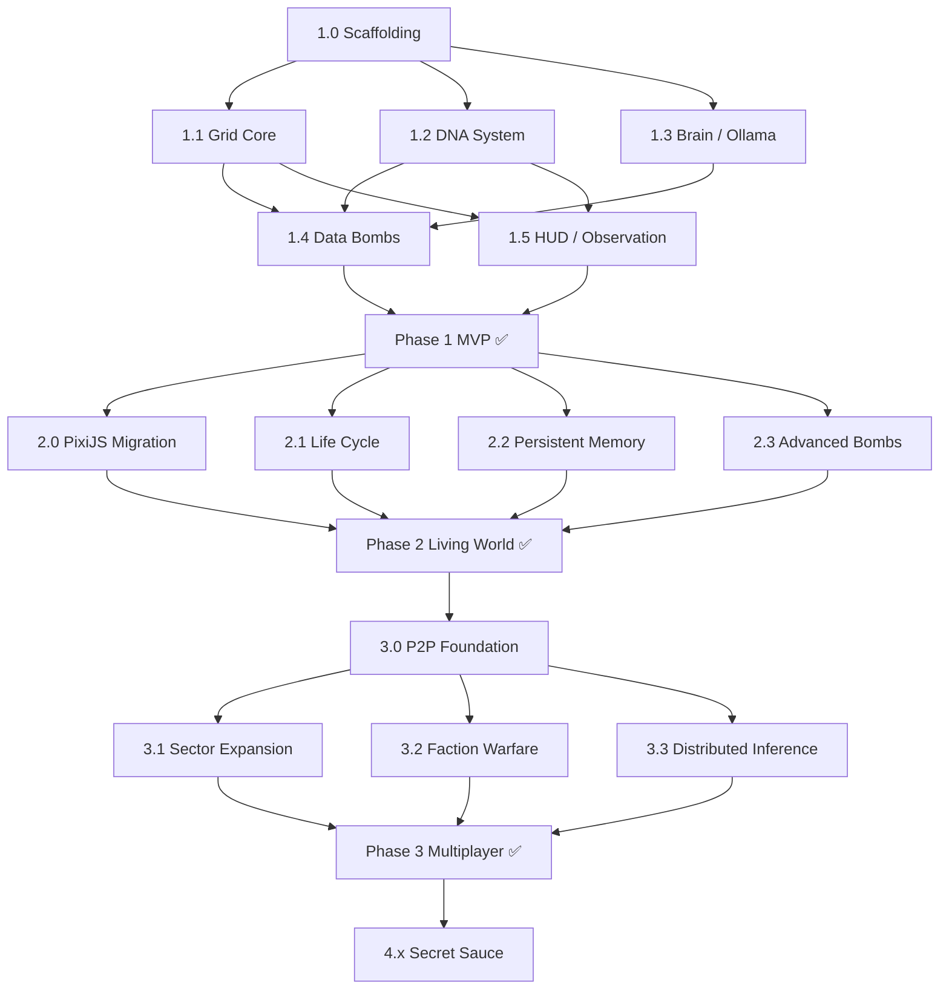

# 🧠 Synaptic Sandbox – Implementation Backlog

**Source:** [SYNAPTIC_SANDBOX_PLAN.md](file:///c:/Users/Cary/Documents/GitHub/Echo-Echo/SYNAPTIC_SANDBOX_PLAN.md)  
**Created:** 2026-03-16  
**Status:** Draft – Pending Architect Review

---

## How to Read This Backlog

Each **Epic** maps to a major system module or cross-cutting concern. Epics contain **Stories** (user-facing capabilities) which break down into **Tasks** (atomic work items an agent or developer can pick up). Every task is tagged:

| Tag | Meaning |
|-----|---------|
| `[INFRA]` | Tooling, CI/CD, repo scaffolding |
| `[GRID]` | Module A – Frontend / Rendering |
| `[BRAIN]` | Module B – Inference Engine |
| `[NET]` | Module C – P2P / Networking |
| `[DNA]` | Agent DNA & Faction Systems |
| `[UX]` | Player-facing HUD & Controls |
| `[AUDIO]` | Sound & Vibe Score |
| `[IO]` | File import/export (Data Bombs, .dna) |

Priority uses **MoSCoW**: **M**ust / **S**hould / **C**ould / **W**on't (this phase).

---

## Phase 1 — The "Grey Box" (MVP)

> **Goal:** A playable single-player sandbox on localhost. Circles on a grid, one local LLM, text data bombs, observable emergent behavior.

---

### Epic 1.0 · Project Scaffolding `[INFRA]`

| # | Task | Priority | Acceptance Criteria |
|---|------|----------|---------------------|
| 1.0.1 | Initialize Tauri 2.0 project with Svelte 5 frontend template | **M** | `cargo tauri dev` opens a window with Svelte "Hello World." |
| 1.0.2 | Configure monorepo structure: `/src-tauri` (Rust), `/src` (Svelte/TS), `/src/engine` (shared game logic) | **M** | Clear separation; each directory compiles independently. |
| 1.0.3 | Set up dev tooling: ESLint, Prettier, Vitest, Rust `clippy` + `fmt` | **M** | `npm run lint` and `cargo clippy` pass with zero warnings. |
| 1.0.4 | CI pipeline: GitHub Actions for lint, test, and Tauri build on push | **S** | Green badge on `develop` branch. |
| 1.0.5 | Add `CONTRIBUTING.md` with module naming conventions (`[GRID-DEV]`, `[BRAIN-DEV]`, etc.) | **S** | Document exists and matches Section 8 of the design doc. |

---

### Epic 1.1 · The Grid – Core Rendering `[GRID]`

| # | Task | Priority | Acceptance Criteria |
|---|------|----------|---------------------|
| 1.1.1 | Create a 2D canvas grid component (Svelte + `<canvas>`) with pan/zoom controls | **M** | User can pan and zoom a grid of at least 100×100 cells. |
| 1.1.2 | Render agents as colored circles on the grid; color derived from DNA vector | **M** | 200 agents visible, each with a unique color gradient based on their `[A-E]` vector. |
| 1.1.3 | Implement a basic spring-mass physics loop for agent movement (brownian drift) | **M** | Agents move organically; no agent overlaps permanently. |
| 1.1.4 | Add grid "Sector" boundaries (visual dividers) | **S** | Sectors are visually distinct; boundary lines render on canvas. |
| 1.1.5 | Implement agent selection (click) → show DNA inspector sidebar | **M** | Clicking an agent opens a panel displaying its vector scores, lore-cache, and lingo. |
| 1.1.6 | Performance benchmark: maintain 60 fps with 500 agents on canvas | **S** | Profiler confirms ≤16ms frame times at 500 agents. |

---

### Epic 1.2 · Agent DNA System `[DNA]`

| # | Task | Priority | Acceptance Criteria |
|---|------|----------|---------------------|
| 1.2.1 | Define `AgentDNA` TypeScript interface: vector `[A-E]`, lore-cache (string[10]), lingo (Map<string,string>) | **M** | Interface is in `src/types/agent.ts`; all downstream code uses it. |
| 1.2.2 | Implement `AgentFactory` – spawns N agents with randomized DNA within configurable bounds | **M** | `createAgents(200)` returns 200 unique agents; vectors are bounded [0,1]. |
| 1.2.3 | Implement DNA mutation function: given raw LLM output, update vector scores + lore-cache | **M** | Unit test: feeding a "pro-order" text shifts the Order axis by a configurable delta. |
| 1.2.4 | Implement "Meme Swap" – neighboring agents exchange lingo entries with probability proportional to ideological similarity | **M** | After 100 ticks, agents in close proximity share ≥1 lingo entry. |
| 1.2.5 | Implement faction classification: auto-assign agents to Hive/Void/Citadel/Fringe based on DNA thresholds | **S** | Faction label appears in the DNA inspector; colors match faction identity. |
| 1.2.6 | Implement "Conflict State" detection: when two opposing-faction clusters overlap, trigger a merge event | **S** | Visual + event log confirms conflict; losing agents are "consumed" (removed or converted). |

---

### Epic 1.3 · The Brain – Local LLM Integration `[BRAIN]`

| # | Task | Priority | Acceptance Criteria |
|---|------|----------|---------------------|
| 1.3.1 | Tauri sidecar command to detect a running Ollama instance and list available models | **M** | Rust function returns `Vec<String>` of model names or a clear "Ollama not found" error. |
| 1.3.2 | Implement `ThoughtOrchestrator` – queues agent "thought requests" and rate-limits them (max N concurrent) | **M** | With 200 agents, queue processes at a steady rate without OOM or starvation. |
| 1.3.3 | Design the **DNA Mutation Prompt** template: system prompt that instructs the LLM to output structured JSON with updated vector scores + new lingo | **M** | Prompt is version-controlled in `src/engine/prompts/dna_mutation.txt`; LLM returns valid JSON. |
| 1.3.4 | Implement `DNAParser` – validates and extracts structured data from LLM response | **M** | Unit test: given a well-formed response, parser returns a typed `DNAUpdate` object. Edge case: malformed JSON returns a graceful fallback (no mutation). |
| 1.3.5 | Implement `ContextTruncator` – summarizes lore-cache when it exceeds a token budget | **S** | When lore-cache exceeds 512 tokens, truncator condenses it to ≤256 tokens via an LLM summarization call. |
| 1.3.6 | Settings panel: user can select Ollama model, set concurrency limit, and toggle "auto-think" (continuous vs. step-by-step) | **S** | Settings persist across sessions via Tauri `app_data` store. |

---

### Epic 1.4 · Data Bombs `[IO]`

| # | Task | Priority | Acceptance Criteria |
|---|------|----------|---------------------|
| 1.4.1 | "Drop Zone" UI: drag-and-drop or click-to-upload area for text input | **M** | User can type or paste text into a modal; clicking "Drop" targets a grid coordinate. |
| 1.4.2 | Blast radius logic: given a drop coordinate and radius R, identify all agents within R cells | **M** | Unit test: dropping at (50,50) with R=5 returns all agents within a 5-cell Manhattan distance. |
| 1.4.3 | Trigger DNA mutation on all agents in the blast radius using the dropped text as context | **M** | After a drop, affected agents' DNA visibly shifts within 1–3 ticks. |
| 1.4.4 | Visual effect: "shockwave" ripple animation on the grid at the drop point | **S** | Canvas renders an expanding ring from the drop point. |
| 1.4.5 | Data Bomb history log: record all drops with timestamp, content preview, and affected agent count | **S** | History panel shows past drops; clicking one highlights affected agents. |

---

### Epic 1.5 · HUD & Observation Layer `[UX]`

| # | Task | Priority | Acceptance Criteria |
|---|------|----------|---------------------|
| 1.5.1 | **Lingo Cloud** overlay: word cloud rendered above agent clusters showing most-common lingo terms | **M** | Top 10 terms per visible cluster are rendered; font size ∝ frequency. |
| 1.5.2 | **Newsfeed** panel: real-time scrolling log of simulation events | **M** | Events like "Agent #42 adopted lingo 'Sec-Jedi'" appear in ≤1s. |
| 1.5.3 | Simulation speed controls: pause, 1×, 2×, 5×, step-forward | **M** | Pause freezes all ticks; step-forward advances exactly 1 tick. |
| 1.5.4 | Global stats bar: total agents, faction distribution pie chart, average "peace score" | **S** | Stats update every tick; chart re-renders reactively. |
| 1.5.5 | Dark mode / Light mode toggle following Svelte 5 theming best practices | **S** | Both themes are visually polished; default to dark. |

---

## Phase 2 — The "Living World"

> **Goal:** Visual fidelity leap. Agents have life cycles, memory, and the grid looks *alive*.

---

### Epic 2.0 · PixiJS Migration `[GRID]`

| # | Task | Priority | Acceptance Criteria |
|---|------|----------|---------------------|
| 2.0.1 | Replace `<canvas>` renderer with PixiJS 8 (WebGPU backend) | **M** | All Phase 1 visuals work identically on PixiJS; fps ≥ 60 at 500 agents. |
| 2.0.2 | Implement "wobble" shader: agents gently pulsate based on their activity level | **M** | Idle agents pulse slowly; agents mid-thought pulse faster. |
| 2.0.3 | Implement "glow" shader: faction-colored halos around agents | **S** | Hive = amber glow, Void = purple, Citadel = cyan, Fringe = red. |
| 2.0.4 | Implement ragdoll death animation when an agent is "consumed" | **S** | Consumed agents visually crumble/scatter before being removed. |
| 2.0.5 | Performance benchmark: maintain 60 fps with **5,000 agents** on PixiJS WebGPU | **M** | Profiler confirms ≤16ms frame times. |

---

### Epic 2.1 · Agent Life Cycle `[DNA]`

| # | Task | Priority | Acceptance Criteria |
|---|------|----------|---------------------|
| 2.1.1 | Implement agent "Reproduction": when two ideologically-similar agents are adjacent for N ticks, spawn a child with blended DNA | **M** | Child agent appears between parents; DNA is a weighted average of parents' vectors. |
| 2.1.2 | Implement agent "Death": agents have an energy meter that depletes; isolation or conflict accelerates depletion | **M** | Dead agents trigger the ragdoll animation and are removed from the simulation. |
| 2.1.3 | Population dynamics dashboard: birth/death rate graph over time | **S** | Line chart updates in real-time in the HUD. |
| 2.1.4 | "Natural Selection" pressure: agents with extreme DNA vectors (near 0 or 1) have slightly higher death rates | **C** | Config toggle; when enabled, population naturally drifts toward moderation unless influenced. |

---

### Epic 2.2 · Persistent Memory `[BRAIN]`

| # | Task | Priority | Acceptance Criteria |
|---|------|----------|---------------------|
| 2.2.1 | Integrate Mem0 (or equivalent) for per-agent long-term memory | **M** | Agent memory persists across simulation save/load cycles. |
| 2.2.2 | Memory-influenced behavior: agents reference past interactions in their "thought" prompts | **M** | LLM prompt includes top-3 relevant memories retrieved via embedding similarity. |
| 2.2.3 | "Amnesia Bomb" data bomb type: wipes lore-cache and memory of affected agents | **S** | Affected agents reset to baseline behavior within 2–3 ticks. |

---

### Epic 2.3 · Advanced Data Bombs `[IO]`

| # | Task | Priority | Acceptance Criteria |
|---|------|----------|---------------------|
| 2.3.1 | PDF Data Bomb: extract text from a dropped PDF via Tauri file-system API + Rust PDF parser | **M** | User drops a PDF; text is extracted and used as bomb payload. |
| 2.3.2 | URL Data Bomb: fetch and extract readable text from a dropped URL | **S** | User pastes a URL; content is scraped and used as payload. |
| 2.3.3 | "Manifesto" bomb type: high-weight bomb that mutates DNA more aggressively and has a larger blast radius | **S** | Manifesto bombs visually distinct (red shockwave); mutation delta is 2× normal. |

---

## Phase 3 — The "Consciousness War" (Multiplayer)

> **Goal:** Peer-to-peer multiplayer. Players compete for ideological dominance across shared sectors.

---

### Epic 3.0 · P2P Networking Foundation `[NET]`

| # | Task | Priority | Acceptance Criteria |
|---|------|----------|---------------------|
| 3.0.1 | Integrate LibP2P (Rust) into the Tauri backend as a networking sidecar | **M** | Tauri app can discover and connect to peers on a local network. |
| 3.0.2 | Implement "Sector Host" role: a node that owns and runs simulation for a sector | **M** | Host node processes all agent ticks for its sector; visitors receive state snapshots. |
| 3.0.3 | Implement "Visitor" role: a node that observes and interacts with a remote sector | **M** | Visitor can drop data bombs on a remote sector; effects are reflected after host processes them. |
| 3.0.4 | State synchronization protocol: sector state diffs broadcast to all visitors at a configurable tick rate | **M** | Visitors see agent movement with ≤500ms latency on LAN. |
| 3.0.5 | NAT traversal and relay fallback for WAN connectivity | **S** | Two players on different home networks can connect. |

---

### Epic 3.1 · Sector Expansion `[NET]`

| # | Task | Priority | Acceptance Criteria |
|---|------|----------|---------------------|
| 3.1.1 | Dynamic sector generation: when user count exceeds threshold N, spawn a new sector | **M** | New sector appears on the global map; a peer is auto-assigned as host. |
| 3.1.2 | Sector border mechanics: agents can migrate between adjacent sectors | **S** | Migration triggers a handoff from one sector host to another. |
| 3.1.3 | Global map view: a zoomed-out view showing all sectors, their faction dominance, and connections | **M** | Map renders as a node graph with faction-colored sectors. |

---

### Epic 3.2 · Faction Warfare `[DNA]` `[NET]`

| # | Task | Priority | Acceptance Criteria |
|---|------|----------|---------------------|
| 3.2.1 | "Global Goal" tracker: each faction has a persistent victory progress bar | **M** | HUD shows all four faction progress bars updated from the global state. |
| 3.2.2 | "Compute Boost": players donate local GPU cycles to amplify their faction's influence in inference priority | **S** | Player with more contributed compute gets more "thought cycles" allocated to their faction's agents. |
| 3.2.3 | "Manifesto Defusal": high-weight bombs require collective compute from opposing factions to neutralize | **C** | A manifesto dropped in a contested sector shows a "defuse progress" bar; opposing players contribute compute to fill it. |

---

### Epic 3.3 · Distributed Inference `[BRAIN]` `[NET]`

| # | Task | Priority | Acceptance Criteria |
|---|------|----------|---------------------|
| 3.3.1 | Integrate Petals for distributed LLM inference across peers | **M** | A 70B+ model can be run collaboratively across 4+ peers. |
| 3.3.2 | "God Mode" inference: high-tier model processes critical simulation events (faction wars, manifestos) | **S** | Critical events are routed to the distributed 70B model; standard events use local 1B model. |
| 3.3.3 | Inference load balancer: distribute thought requests across peers based on available GPU capacity | **M** | No single peer is overloaded; requests are spread proportionally. |

---

## Phase ∞ — Secret Sauce & Polish

> **Goal:** The features that make it a *cult hit*.

---

### Epic 4.0 · The Lingo-Gen `[DNA]` `[BRAIN]`

| # | Task | Priority | Acceptance Criteria |
|---|------|----------|---------------------|
| 4.0.1 | Prompt engineering: LLM generates portmanteau "slang" based on ingested data themes | **M** | Bombing agents with "Star Wars + Marxism" produces terms like "Sec-Jedi" in their lingo dict. |
| 4.0.2 | Lingo propagation visualization: animated "word bubbles" travel between agents during meme swaps | **S** | Bubbles are visible on the grid, floating from sender to receiver. |
| 4.0.3 | "Lingo Leaderboard": top 10 most viral terms across the entire simulation | **C** | Leaderboard panel in the HUD; updates every N ticks. |

---

### Epic 4.1 · Exportable DNA `[IO]`

| # | Task | Priority | Acceptance Criteria |
|---|------|----------|---------------------|
| 4.1.1 | "Save Cult" feature: export a selected group of agents as a `.dna` file (JSON with DNA + lore + lingo) | **M** | File saves to disk via Tauri save dialog; file is human-readable JSON. |
| 4.1.2 | "Import Cult" feature: load a `.dna` file and spawn those agents as an "Invader" group at a chosen location | **M** | Imported agents appear with their original DNA; they immediately begin interacting with locals. |
| 4.1.3 | `.dna` file validation and versioning schema | **S** | Invalid or outdated `.dna` files show a clear error toast; auto-migration for old versions. |

---

### Epic 4.2 · The Vibe Score `[AUDIO]`

| # | Task | Priority | Acceptance Criteria |
|---|------|----------|---------------------|
| 4.2.1 | Implement a generative ambient soundtrack engine (Web Audio API) | **S** | Background audio plays procedurally generated ambient tones. |
| 4.2.2 | Map global "Peace vs. War" ratio to soundtrack parameters (tempo, key, dissonance) | **S** | Peaceful state = slow, major key; wartime = fast, minor/dissonant. |
| 4.2.3 | SFX: data bomb drop, agent death, conflict trigger, meme swap | **C** | Each event plays a distinct, non-jarring sound effect. |

---

### Epic 4.3 · Ideology Heatmap `[GRID]` `[UX]`

| # | Task | Priority | Acceptance Criteria |
|---|------|----------|---------------------|
| 4.3.1 | WebGPU compute shader: generate a real-time heatmap texture from agent DNA density | **M** | Heatmap layer toggleable in the HUD; shows faction density gradients across the grid. |
| 4.3.2 | Heatmap color scheme per faction (configurable) | **S** | User can choose between "faction colors" and "peace/war gradient" modes. |

---

## Dependency Graph (Suggested Build Order)

---

## Risk Register

| Risk | Impact | Likelihood | Mitigation |
|------|--------|------------|------------|
| Ollama performance too slow for 200+ agents | High | Medium | Batch requests; cache identical prompts; reduce thought frequency. |
| PixiJS WebGPU not stable on all GPUs | Medium | Medium | Fallback to WebGL2 renderer; feature-detect at startup. |
| LibP2P NAT traversal fails on strict firewalls | High | High | Provide relay server option; document port-forwarding instructions. |
| LLM generates invalid JSON for DNA updates | Medium | High | Strict schema validation in `DNAParser`; retry with simplified prompt on failure. |
| Agent "lingo" devolves into gibberish | Low | Medium | Constrain lingo-gen prompt to produce pronounceable portmanteaus; add a "readability" filter. |

---

*End of Backlog. Ready for Architect review.*
